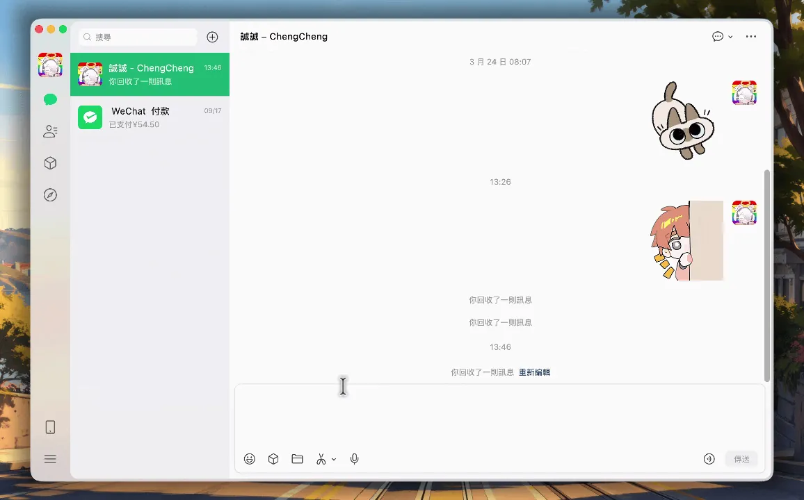

[简体中文](README.md) | [繁體中文](README.zh-TW.md) | [English](README.en.md)

<p align="center"></p>

# ShiftIME

**像 Windows 一样，在 Mac 上单按 `Shift` 切换中英文。** [下载最新版本](https://github.com/TW527E/ShiftIME/releases/latest)

<p align="center"></p>

ShiftIME 是一个原生、轻量且事件驱动的 macOS 输入法切换增强工具。它在后台运行，默认显示于菜单栏且不显示于 Dock。

## 功能

### Shift 输入法切换

- 单独点按 `Shift`，从当前输入法切换到最近使用的英文输入法。
- 已在英文输入法时，再次点按 `Shift` 会返回上次使用的输入法。
- 返回 Apple 拼音时会等待并确认输入来源已完成选择；如果 macOS 尚未完成切换，会自动重试，并暂存切换期间的第一个字符，避免显示为拼音却只能输入英文。
- 切换后由 macOS 在文字光标旁显示原生输入法提示；仅在输入框中 App 未应用新输入法时才短暂转移焦点，避免提示被关闭。
- Shift 用于输入大写字母、组合快捷键、Shift 点击或 Shift 滚动时不会误触发。

### Shift + Space 拼音全／半形切换

- 在 Apple 拼音输入法中按 `Shift + Space`，切换系统全形／半形标点模式。
- 不显示切换提示。
- 支持 Apple 拼音－繁体和拼音－简体。
- **不应用于 Apple 注音输入法**；在注音或其他输入法中，`Shift + Space` 会原样传给当前应用。

以上两项功能可以在设置中分别启用或停用。

### 远程软件与游戏放行

- 默认在常见远程桌面、串流软件和游戏中同时放行 `Shift` 与 `Shift + Space`，避免快捷键被 ShiftIME 拦截。
- 自动识别常见远程软件、macOS 游戏分类，以及 Steam、GOG、Epic 游戏路径。
- 可以在设置的应用程序列表中加入其他 App，并分别开关 `Shift` 与 `Shift + Space` 放行规则。
- 新加入的 App 默认同时放行两项快捷键；菜单栏菜单也能快速加入当前 App。

## 其他设置

- 显示菜单栏图标，默认开启。
- 显示 Dock 图标，默认关闭。
- macOS 未显示光标旁提示时，改在屏幕中央显示切换提示，默认关闭。
- 如果同时隐藏两个图标，再次从 Finder 打开 ShiftIME 即可返回设置。

## 系统要求与权限

- macOS 13 或以上。
- “系统设置 → 隐私与安全性 → 辅助功能”。
- “系统设置 → 隐私与安全性 → 输入监控”。

首次启动会显示设置窗口与权限状态。如果重新构建了 ad-hoc 签名的应用，macOS 可能要求重新授权。

## 本地构建

需要 Apple Swift 工具链；也可以直接使用 Xcode 打开 `Package.swift`。

```bash
# 纯 Swift 状态机与输入来源识别检查
make test

# 创建 dist/ShiftIME.app
make app

# 创建 dist/ShiftIME-1.0.0.dmg
make dmg
```

创建同时支持 Apple Silicon 和 Intel 的 Universal Binary：

```bash
BUILD_ARCHS="arm64 x86_64" VERSION=1.0.0 make dmg
```

其他可用参数：

```bash
VERSION=1.0.0 BUILD_NUMBER=2 CONFIGURATION=release make app
```

运行完整验证：

```bash
make verify
```

## 安装 DMG

1. 从 [Releases](https://github.com/TW527E/ShiftIME/releases/latest) 下载并打开 `ShiftIME-<版本>.dmg`（或本机构建的 `dist/ShiftIME-<版本>.dmg`）。
2. 将 `ShiftIME.app` 拖入映像中的 `Applications` 快捷方式。
3. 从“应用程序”启动 ShiftIME。
4. 按照设置窗口指示授予两项键盘权限。

从旧版 ShiftInput 升级：请先退出并删除 `ShiftInput.app`，否则两个应用会同时响应 Shift；ShiftIME 需要重新授予键盘权限，设置也会恢复默认值。

## GitHub Actions

`.github/workflows/build-dmg.yml` 会在以下情况运行：

- 推送到 `main`。
- 创建 Pull Request。
- 手动运行 workflow。

流程会执行检查、创建 `arm64 + x86_64` Universal Binary、封装 DMG、验证磁盘映像，最后作为 GitHub Actions artifact 上传。

要发布新版本，请修改根目录 `VERSION` 中的语义化版本号（例如 `0.3.0`），提交并推送到 `main`。构建成功后，workflow 会自动创建对应的 `v0.3.0` 标签和 GitHub Release、附上 DMG，并在 Release 说明中列出自上一个版本以来的所有 commits。已存在的版本标签不会被覆盖。

## 技术设计

- Swift、AppKit、Core Graphics、Text Input Source Services。
- `CGEventTap` 只拦截键盘事件；Shift 点击与 Shift 滚动改用窗口服务器的事件计数判断，系统的鼠标和滚动事件完全不经过 ShiftIME。
- 使用系统输入来源通知，不持续轮询输入法状态。
- 每次输入来源通知只读取一次系统快照，并一致地更新保存来源、拼音能力和界面。
- 使用 `TISSelectInputSource` 切换输入法并保存上次来源；切换后以当前来源 ID 与选择状态确认，必要时有限重试，并在确认完成前暂存普通文字按键与 Shift，避免切换后立即输入的大写字母被拼音当成单独的 Shift 而切换中英文。
- `Shift + Space` 仅在识别为 Apple 拼音时转发为原生 `Option + Shift + H` 命令。
- 仅在前台 App 改变时更新应用程序数据；远程软件和游戏放行判断不会轮询窗口或进程。
- Event tap 超时停用时会自动恢复；权限被撤销时会停止监听。
- Event tap 被系统停用时会安全重建；切换快捷键设置无需重建监听器。

## 项目结构

```text
.github/workflows/build-dmg.yml  GitHub Actions DMG 构建
VERSION                          应用程序与 Release 版本号
Sources/ShiftIMECore/          可测试的纯 Swift 逻辑
Sources/ShiftIME/              AppKit 应用与系统集成
Resources/AppIcon.png            应用图标 1024px 主图
Scripts/build-app.sh             .app 构建脚本
Scripts/generate-app-icon.sh     ICNS 图标尺寸集生成脚本
Scripts/create-dmg.sh            DMG 打包脚本
Scripts/smoke-test-app.sh        应用生命周期与菜单栏检查
Scripts/StateMachineChecks.swift 状态机与拼音识别检查
Makefile
Package.swift
```
