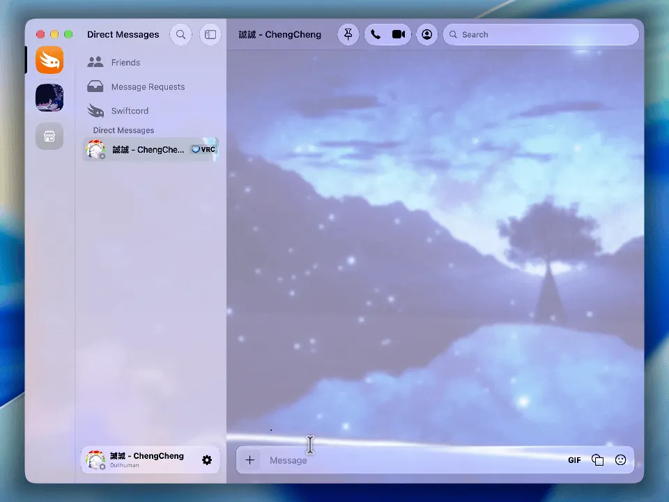

[简体中文](README.md) | [繁體中文](README.zh-TW.md) | [English](README.en.md)

<p align="center"></p>

# ShiftIME

**像 Windows 一樣，在 Mac 上單按 `Shift` 切換中英文。** [下載最新版本](https://github.com/TW527E/ShiftIME/releases/latest)

<p align="center"></p>

ShiftIME 是一個原生、輕量且事件驅動的 macOS 輸入法切換增強工具。它在背景執行，預設顯示於選單列且不顯示於 Dock。

## 功能

### Shift 輸入法切換

- 單獨點按 `Shift`，從目前輸入法切換到最近使用的英文輸入法。
- 已在英文輸入法時，再次點按 `Shift` 會返回上次使用的輸入法。
- 返回 Apple 拼音時會等待並確認輸入來源已完成選取；若 macOS 尚未完成切換，會自動重試，並暫存切換期間的第一個字元，避免顯示為拼音卻只能輸入英文。
- 切換後由 macOS 在文字游標旁顯示原生輸入法提示；僅在輸入框中 App 未套用新輸入法時才短暫轉移焦點，避免提示被關閉。
- Shift 用於輸入大寫字母、組合快捷鍵、Shift 點擊或 Shift 捲動時不會誤觸發。

### Shift + Space 拼音全／半形切換

- 在 Apple 拼音輸入法中按 `Shift + Space`，切換系統全形／半形標點模式。
- 不顯示切換提示。
- 支援 Apple 拼音－繁體與拼音－簡體。
- **不套用於 Apple 注音輸入法**；在注音或其他輸入法中，`Shift + Space` 會原樣傳給目前應用。

以上兩項功能可在設定中分別啟用或停用。

### 遠端軟體與遊戲放行

- 預設在常見遠端桌面、串流軟體及遊戲中，同時放行 `Shift` 與 `Shift + Space`，避免快捷鍵被 ShiftIME 攔截。
- 自動辨識常見遠端軟體、macOS 遊戲分類，以及 Steam、GOG、Epic 遊戲路徑。
- 可在設定的應用程式列表中加入其他 App，並分別開關 `Shift` 與 `Shift + Space` 放行規則。
- 新加入的 App 預設同時放行兩項快捷鍵；選單列選單也能快速加入目前 App。

## 其他設定

- 顯示選單列圖標，預設開啟。
- 顯示 Dock 圖標，預設關閉。
- macOS 未顯示游標旁提示時，改在螢幕中央顯示切換提示，預設關閉。
- 若同時隱藏兩個圖標，再次從 Finder 開啟 ShiftIME 即可回到設定。

## 系統要求與權限

- macOS 13 或以上。
- 「系統設定 → 隱私權與安全性 → 輔助使用」。
- 「系統設定 → 隱私權與安全性 → 輸入監控」。

首次啟動會顯示設定窗口與權限狀態。若重新建置了 ad-hoc 簽署的應用，macOS 可能要求重新授權。

## 本機建置

需要 Apple Swift 工具鏈；也可以直接使用 Xcode 開啟 `Package.swift`。

```bash
# 純 Swift 狀態機與輸入來源辨識檢查
make test

# 建立 dist/ShiftIME.app
make app

# 建立 dist/ShiftIME-1.0.0.dmg
make dmg
```

建立同時支援 Apple Silicon 與 Intel 的 Universal Binary：

```bash
BUILD_ARCHS="arm64 x86_64" VERSION=1.0.0 make dmg
```

其他可用參數：

```bash
VERSION=1.0.0 BUILD_NUMBER=2 CONFIGURATION=release make app
```

執行完整驗證：

```bash
make verify
```

## 安裝 DMG

1. 從 [Releases](https://github.com/TW527E/ShiftIME/releases/latest) 下載並開啟 `ShiftIME-<版本>.dmg`（或本機建置的 `dist/ShiftIME-<版本>.dmg`）。
2. 將 `ShiftIME.app` 拖入映像檔內的 `Applications` 捷徑。
3. 從「應用程式」啟動 ShiftIME。
4. 依設定窗口指示授予兩項鍵盤權限。

從舊版 ShiftInput 升級：請先結束並刪除 `ShiftInput.app`，否則兩個應用會同時回應 Shift；ShiftIME 需要重新授予鍵盤權限，設定也會回到預設值。

## GitHub Actions

`.github/workflows/build-dmg.yml` 會在以下情況執行：

- 推送到 `main`。
- 建立 Pull Request。
- 手動執行 workflow。

流程會執行檢查、建立 `arm64 + x86_64` Universal Binary、封裝 DMG、驗證映像檔，最後以 GitHub Actions artifact 上傳。

要發布新版本，請修改根目錄 `VERSION` 內的語意化版本號（例如 `0.3.0`），提交並推送至 `main`。建置成功後，workflow 會自動建立對應的 `v0.3.0` 標籤與 GitHub Release、附上 DMG，並在 Release 說明列出自上一個版本以來的所有 commits。已存在的版本標籤不會被覆寫。

## 技術設計

- Swift、AppKit、Core Graphics、Text Input Source Services。
- `CGEventTap` 只攔截鍵盤事件；Shift 點擊與 Shift 捲動改以視窗伺服器的事件計數判斷，系統的滑鼠與捲動事件完全不經過 ShiftIME。
- 使用系統輸入來源通知，不持續輪詢輸入法狀態。
- 每次輸入來源通知只讀取一次系統快照，並一致地更新保存來源、拼音能力與介面。
- 使用 `TISSelectInputSource` 切換輸入法並保存上次來源；切換後以目前來源 ID 與選取狀態確認，必要時以有限次數重試，並在確認完成前暫存普通文字按鍵與 Shift，避免切換後立即輸入的大寫字母被拼音當成單獨的 Shift 而切換中英文。
- `Shift + Space` 僅在辨識為 Apple 拼音時轉送為原生 `Option + Shift + H` 命令。
- 前景 App 改變時才更新應用程式資料；遠端軟體與遊戲放行判斷不輪詢窗口或程序。
- Event tap 逾時停用時會自動恢復；權限被撤銷時會停止監聽。
- Event tap 被系統停用時會安全重建；切換快捷鍵設定不需重建監聽器。

## 專案結構

```text
.github/workflows/build-dmg.yml  GitHub Actions DMG 建置
VERSION                          應用程式與 Release 版本號
Sources/ShiftIMECore/          可測試的純 Swift 邏輯
Sources/ShiftIME/              AppKit 應用與系統整合
Resources/AppIcon.png            應用圖標 1024px 主圖
Scripts/build-app.sh             .app 建置腳本
Scripts/generate-app-icon.sh     ICNS 圖標尺寸集產生腳本
Scripts/create-dmg.sh            DMG 封裝腳本
Scripts/smoke-test-app.sh        應用生命週期與選單列檢查
Scripts/StateMachineChecks.swift 狀態機與拼音辨識檢查
Makefile
Package.swift
```

## 授權條款

[MIT](LICENSE)
